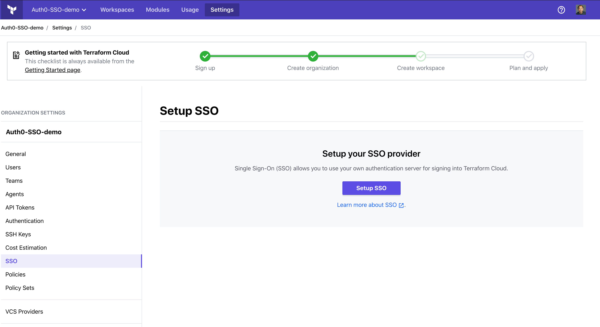
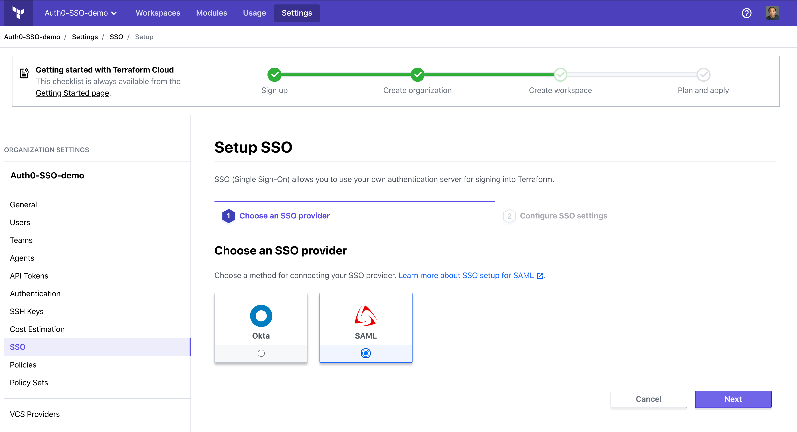
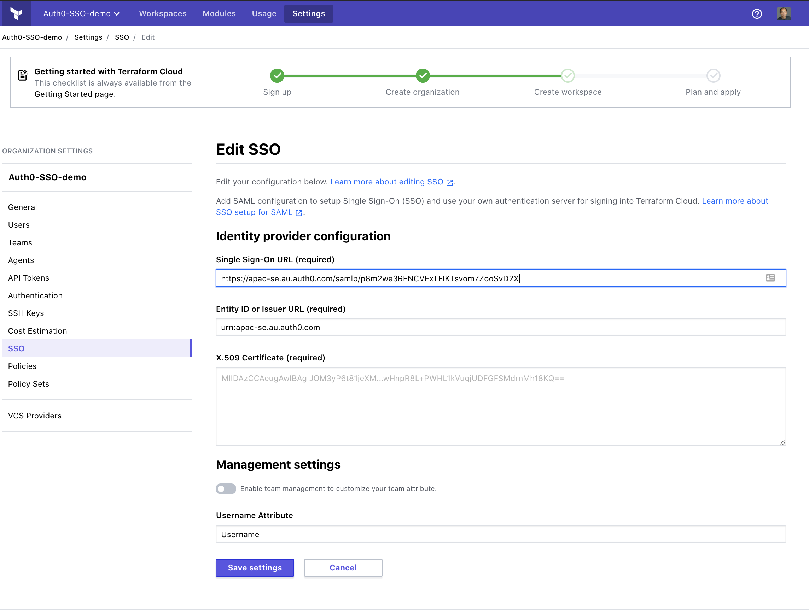
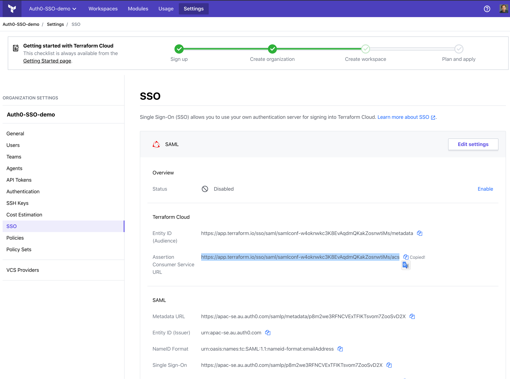
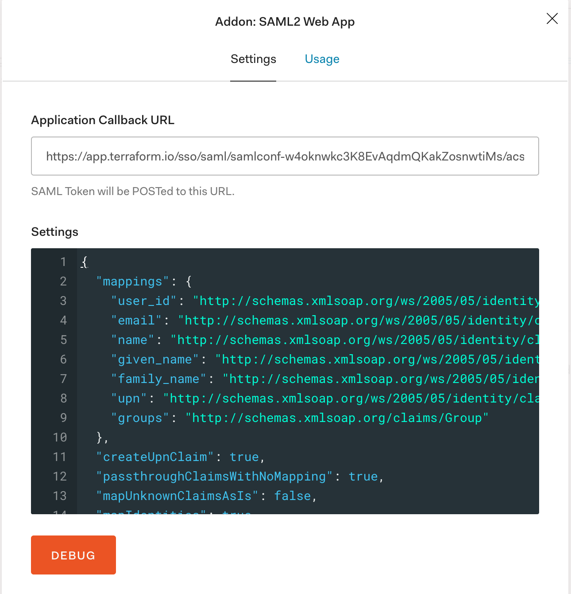
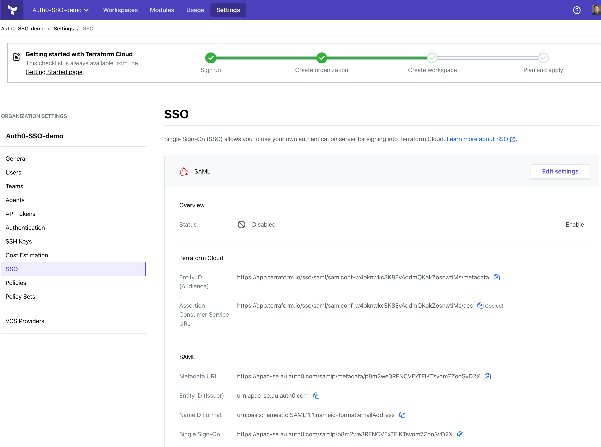
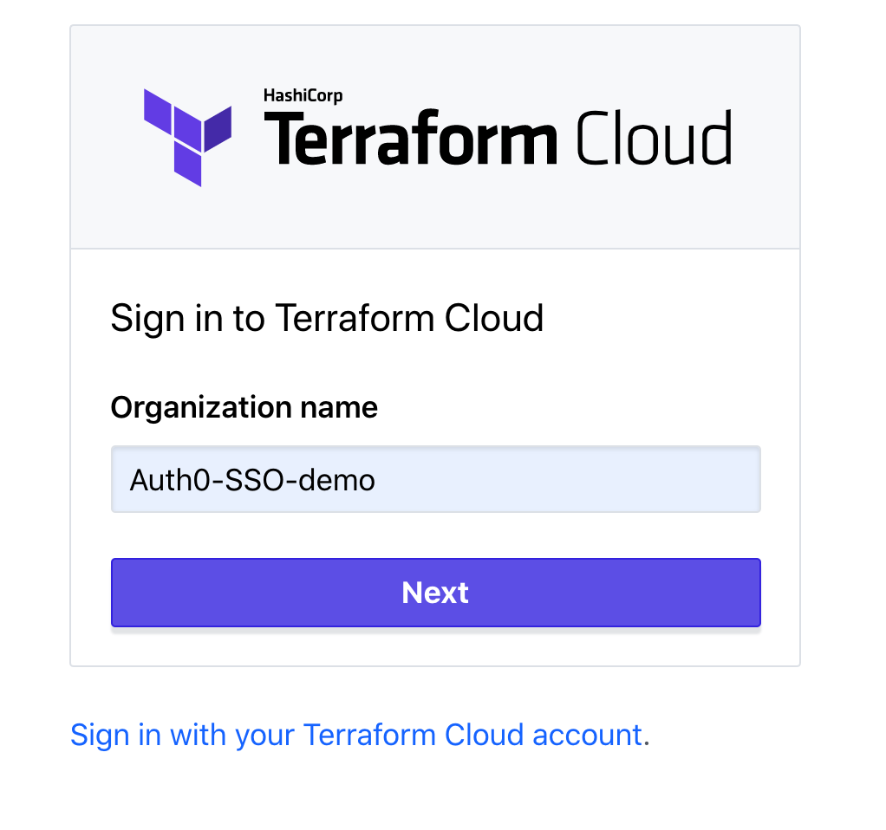
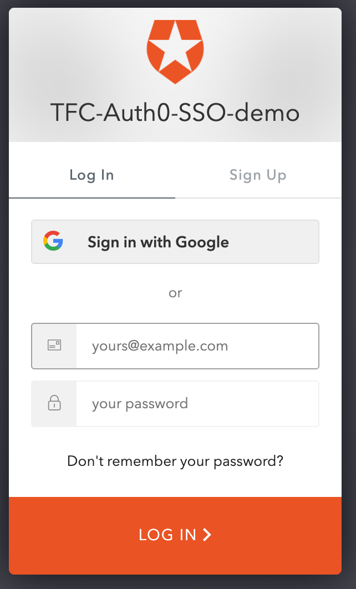
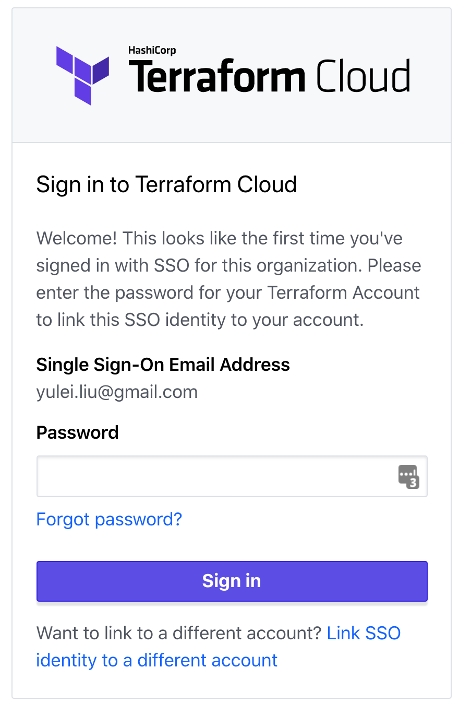

Terraform Cloud for Business has released Single-Sign-On for customers so that you don't have to have use seperate credentials to authenticate with TFC. You can configure SSO using the out-of-box integration with Okta, or a generic SAML 2.0 integration. Auth0 is a popular authentication platform for developers and has been adopted by some large enterprises. The best feature is that it is free for upto 7000 active users. In this artical I am going to show you how to use Auth0 as the Identity Provider to Single-Sign-on into Terraform Cloud for Business.

# Getting started

I assume you already have a Terraform Cloud for Business plan. if you don't, please speak to your Hashicorp Account Manager or reach us from [here](https://www.hashicorp.com/contact-sales).

You also need a Auth0 account, if you don't have one, you can get a free account [here](https://auth0.com/signup).

Once it is enabled, you can access the SSO setup wizard.

# Setting up

1. Setting up Auth0.
   
   Create a new application in Auth0:

   

   Terraform Cloud is a regular website:

      
   
   Authentication between Auth0 and TFC is not done via http(The authentication will be done on the SAML layer):
      

   In the settings windows, paste below contents, this setting will return email address to TFC as the name, which is required by Terraform Cloud:
```xml
{
  "mappings": {
    "user_id":     "http://schemas.xmlsoap.org/ws/2005/05/identity/claims/nameidentifier",
    "email":       "http://schemas.xmlsoap.org/ws/2005/05/identity/claims/emailaddress",
    "name":        "http://schemas.xmlsoap.org/ws/2005/05/identity/claims/name",
    "given_name":  "http://schemas.xmlsoap.org/ws/2005/05/identity/claims/givenname",
    "family_name": "http://schemas.xmlsoap.org/ws/2005/05/identity/claims/surname",
    "upn":         "http://schemas.xmlsoap.org/ws/2005/05/identity/claims/upn",
    "groups":      "http://schemas.xmlsoap.org/claims/Group"
  },
  "createUpnClaim":       true,
  "passthroughClaimsWithNoMapping": true,
  "mapUnknownClaimsAsIs": false,
  "mapIdentities":        true,
  "signatureAlgorithm":   "rsa-sha1",
  "digestAlgorithm":      "sha1",
  "lifetimeInSeconds":    3600,
  "signResponse":         false,
  "typedAttributes":      true,
  "includeAttributeNameFormat":  true,
  "nameIdentifierFormat": "urn:oasis:names:tc:SAML:1.1:nameid-format:unspecified",
  "nameIdentifierProbes": [
    "http://schemas.xmlsoap.org/ws/2005/05/identity/claims/emailaddress",
    "http://schemas.xmlsoap.org/ws/2005/05/identity/claims/name"
  ],
  "authnContextClassRef": "urn:oasis:names:tc:SAML:2.0:ac:classes:unspecified",
  "logout": {
    "callback": "http://foo/logout",
    "slo_enabled": true
  },
  "binding": "urn:oasis:names:tc:SAML:2.0:bindings:HTTP-POST"
  }
```

  Go to the usage page and get the link of Identity Provider Metadata:
      
  
2. Setting up Terraform Cloud
   
   You can access the SSO setup menu from here:
   

   select SAML:

   

   In the Metadata URL field, paste the Identity Provider Metadata URL you copied from last step, remove the Google Analytics query strings,and turn off team management:
   
   

   Once saved, you need to copy the Assertion Consumer Service URL:
   
   

3. Continue on Auth0

   Paste the Assertion Consumer Service URL from Terraform Cloud to Auth0 Application Callback URL on the settings tab, and save.

   

4. Enable the SAML login on Terraform Cloud
   
   

# Try it out
 
   Click on this [link](https://app.terraform.io/sso/sign-in), and type in your orgnisation name:

   

   Auth0 login window will pop up:

   

   you can use Sign in via Google to login, since this is the first time you use SSO to sign-in into this orgnisation, Terraform Cloud will ask you to confirm your Terraform Cloud account password:

   

   Once you link your account, you will be allowed in. You may not be able to see any workspaces if you are not part of any team - by default, users logged in via Single Sign-On will belong to a group called sso, which doesn't have visibility to any workspaces. you can ask the orgnisation owner to assign you to the right team.
   


